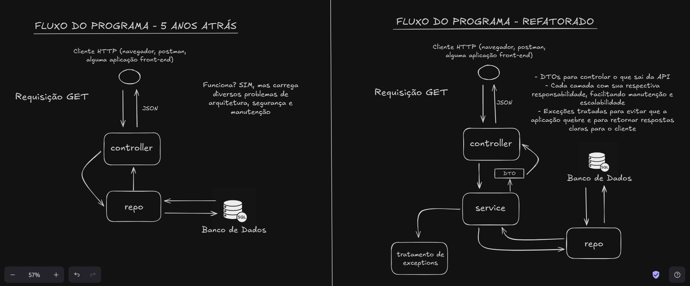

# Diário de Contribuição — Projeto TASKS

**Início: 15/11/2025**  
Este documento registra, de forma informal, todas as minhas alterações e melhorias feitas no projeto **TASKS**, com foco em refatoração, organização e boas práticas.

🔗 **Repositório original:** https://github.com/wcaquinocursos/tasks-backend

🔗 **LinkedIn Post:** https://www.linkedin.com/posts/leonardo-samuel_refatorei-um-c%C3%B3digo-de-5-anos-atr%C3%A1s-nos-activity-7404160381323124737-Cnd-?utm_source=share&utm_medium=member_desktop&rcm=ACoAAFcqRXgBRQWF0qbKr_33kRj6Mc5ZdABq8tg

---

## Sobre o Projeto
É um sistema simples de gerenciamento de tarefas (To-Do), desenvolvido em Java com foco em:
- CRUD de tarefas  
- Validações
- Uso de banco de dados relacional 
- Tratamento de exceções  
- API REST padronizada
  
---

## Tecnologias Utilizadas

- **Java 21**  
- **Spring Boot**  
- **Spring Web**  
- **Spring Data JPA / Hibernate**  
- **MySQL**  
- **Lombok**  
- **Maven**  
- **Postman** (testes)  

---

## 15/11/2025 — Primeiras melhorias
- Projeto não possuía README → criado README inicial.  
- No **Model**:  
  - Adicionado `@Getter` e `@Setter` do Lombok.  
  - Adicionadas validações: `@NotBlank`, `@FutureOrPresent`.  
  - Criados atributos **descrição** e **status** (ENUM: *PENDENTE*, *CONCLUIDA*, *ATRASADA*).  
- Banco de dados migrado para **MySQL** com ajustes em `application.properties`.

---

## 16/11/2025 — Camada Service
- Criada a **camada Service** para organização das regras de negócio.

---

## 17/11/2025 — Exceptions e melhorias no Controller
- Adicionados:  
  - Exceção customizada  
  - GlobalExceptionHandler  
  - JSON de erro padronizado  
- Controller ajustado para usar o **TaskService** em vez do repositório diretamente.

---

## 29/11/2025 — Adicionando DTOs e ajustando entidades
- Adicionei a camada de DTOs à aplicação (TaskCreateDTO, TaskUpdateDTO e TaskResponseDTO) para controlar melhor entrada e saída da API.
- Implementei novas colunas dataCriacao e dataConclusao na entidade de tarefas.

---

## 05/12/2025 — Fluxo da API (antes e depois)

